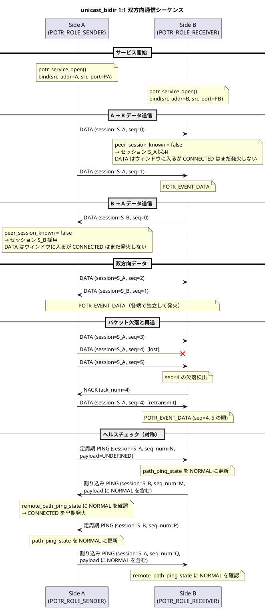
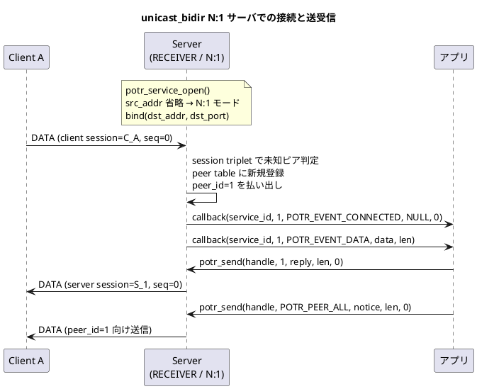
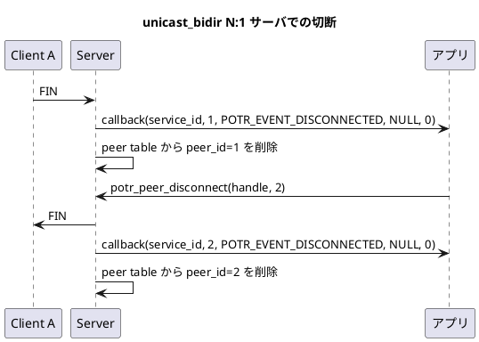
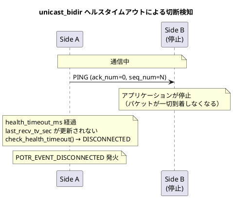

# UDP 双方向通信のシーケンス

[通信シーケンスの一覧](sequence.md) へ戻ります。

## unicast_bidir 1:1 双方向通信

`POTR_TYPE_UNICAST_BIDIR` における双方向データ通信のシーケンスです。  
両端が独立したセッションを持ち、それぞれがデータ送受信・NACK・ヘルスチェックを行います。

## unicast_bidir N:1 サーバーでの接続と送受信

`POTR_TYPE_UNICAST_BIDIR` を N:1 モードで開いたサーバーが、新規クライアントを受け付けて `peer_id` ごとに通信するシーケンスです。

## unicast_bidir N:1 サーバーでの切断

サーバーは FIN 受信、`potr_peer_disconnect()`、またはヘルスチェック タイムアウトによりピア単位で切断を処理します。

## unicast_bidir ヘルスチェック タイムアウトによる切断検知

`POTR_TYPE_UNICAST_BIDIR` において、相手側が停止した場合の切断検知シーケンスです。1:1 モードでは相手端単位、N:1 モードでは各 `peer_id` 単位で `last_recv_tv_sec` を監視し、`health_timeout_ms` 超過で切断を検知します。

