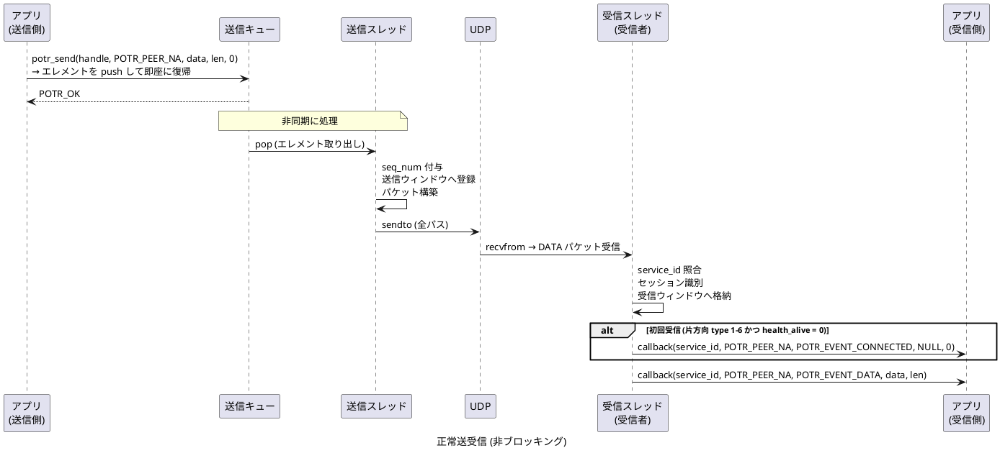
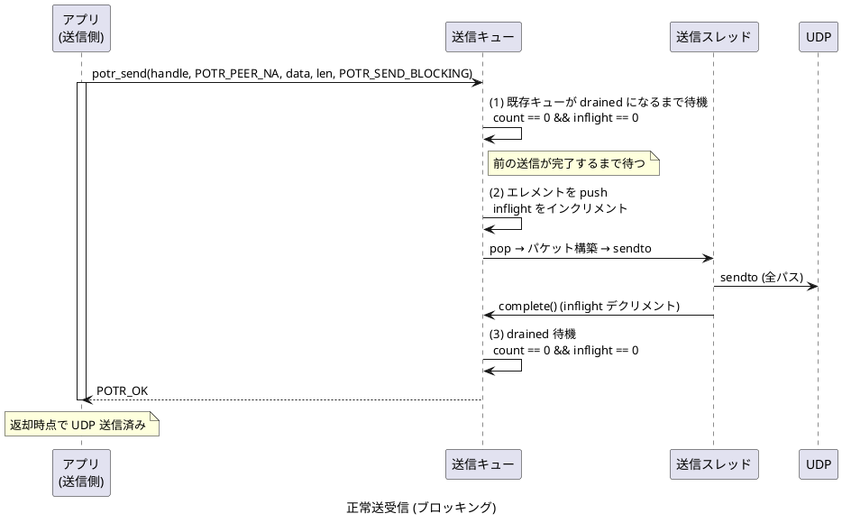
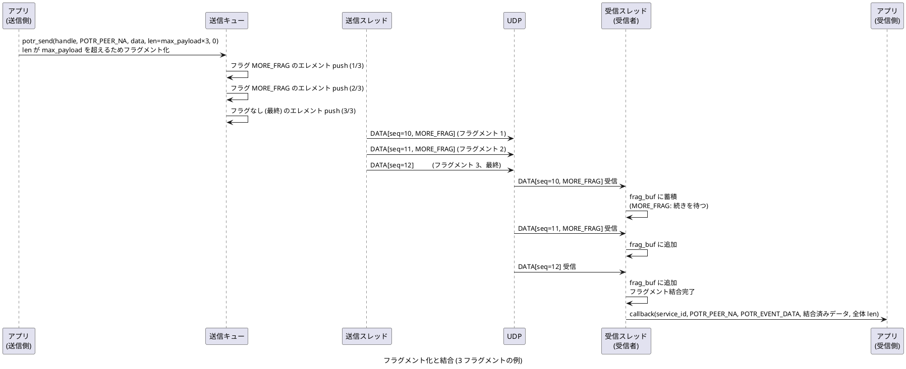
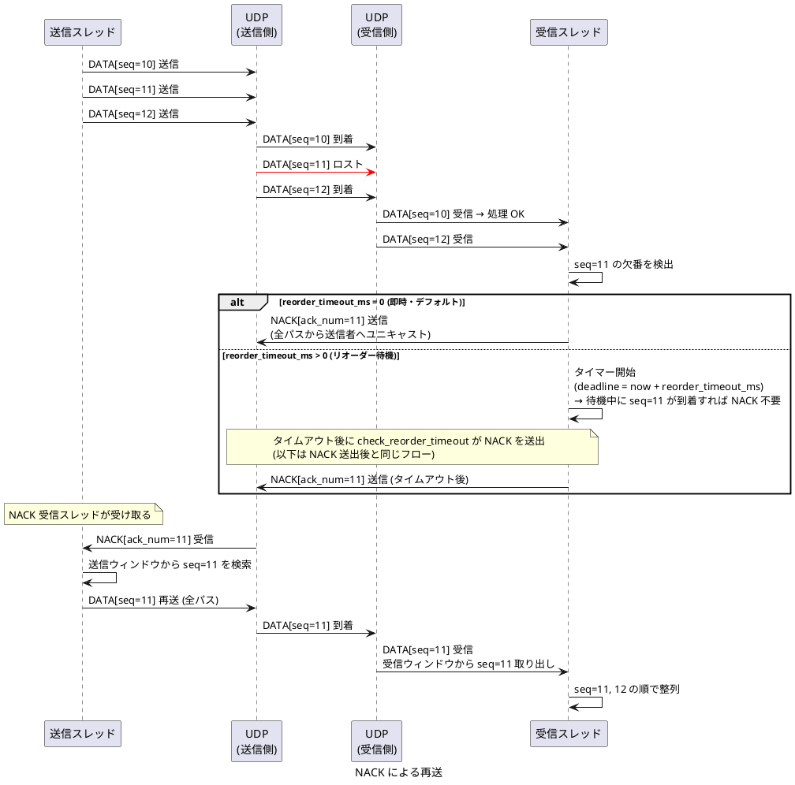
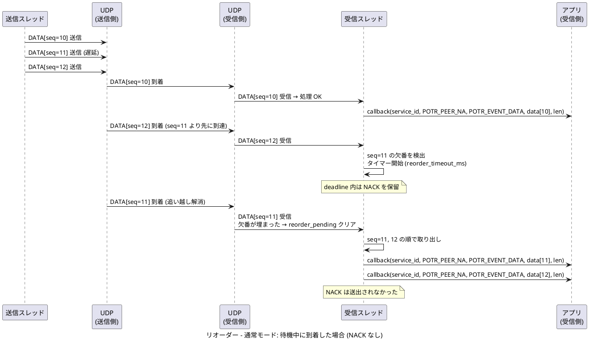
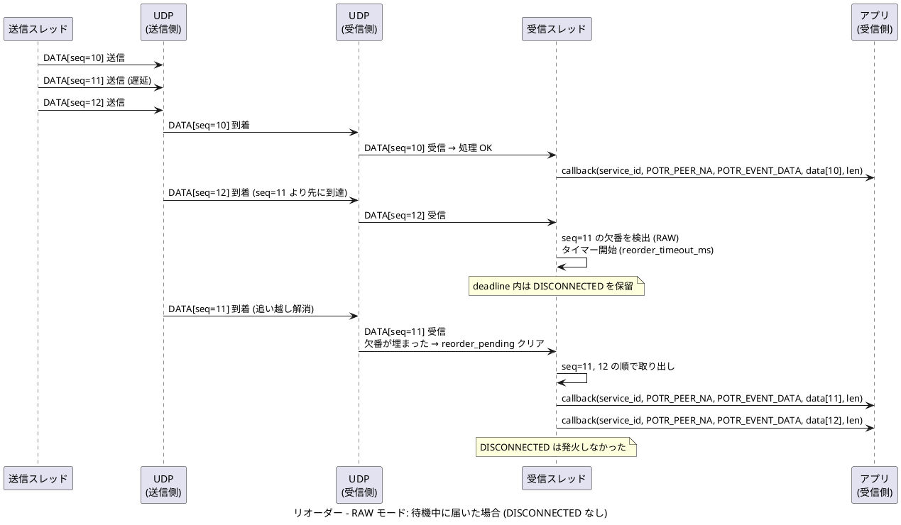
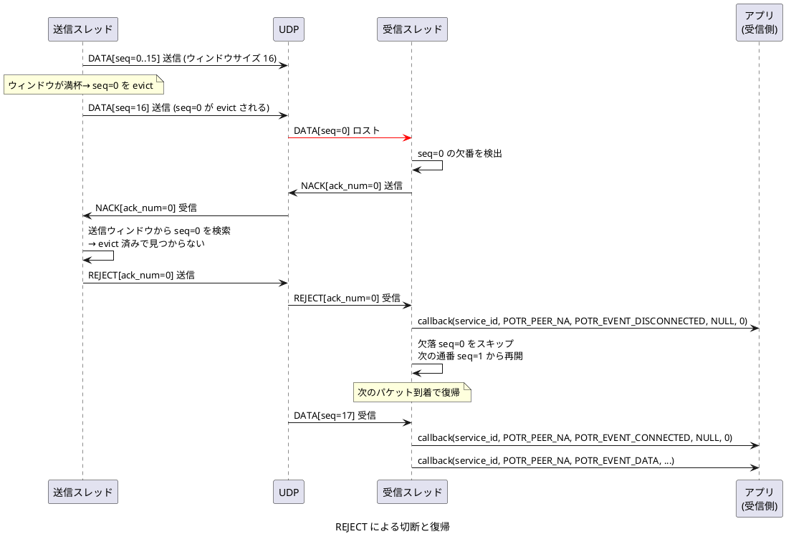
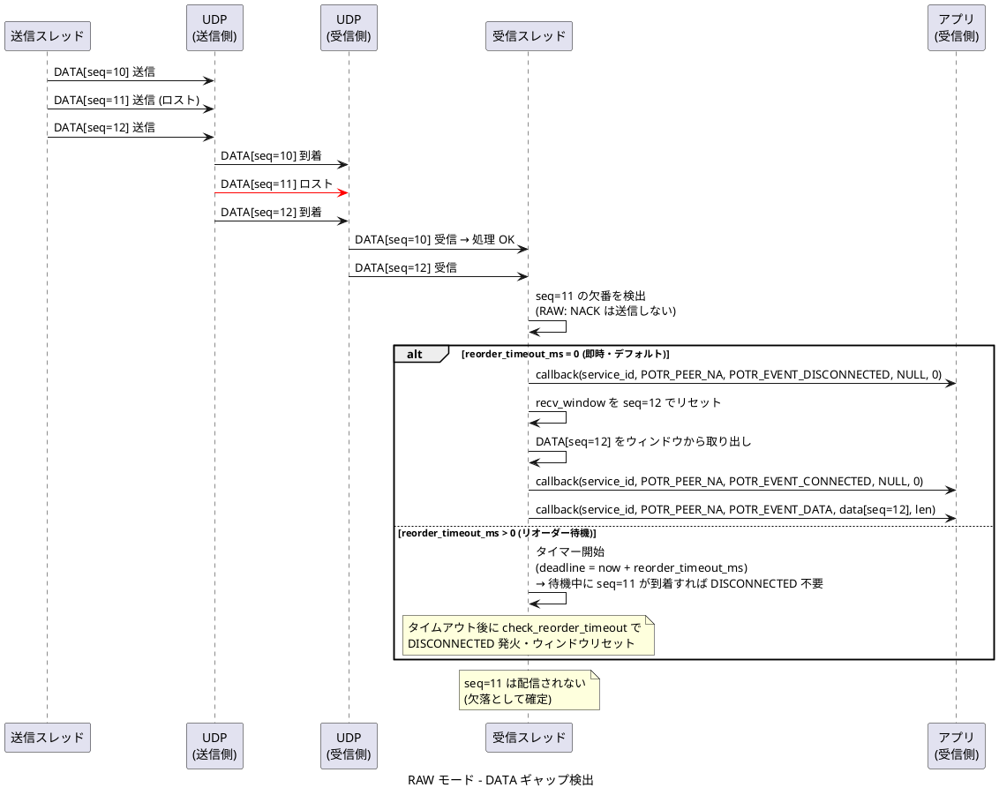
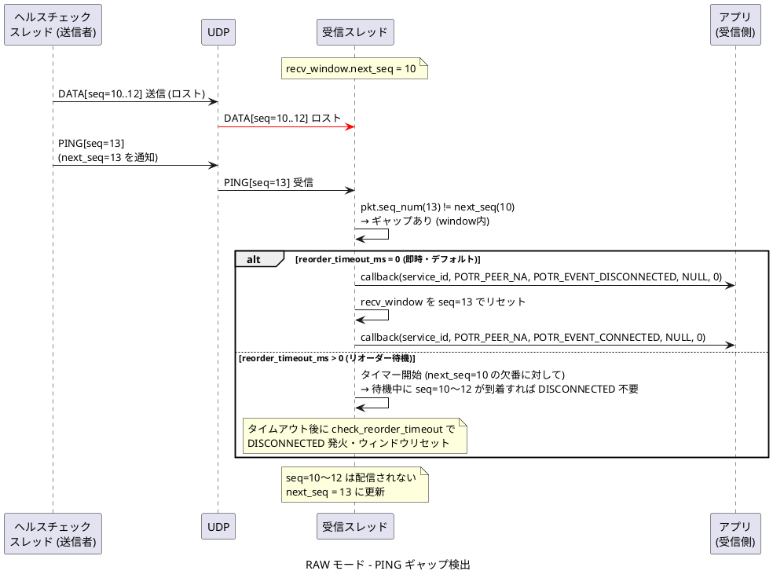

# UDP のデータ転送と再送のシーケンス

[通信シーケンスの一覧](sequence.md) へ戻ります。

## 正常送受信 (非ブロッキング)

`POTR_SEND_BLOCKING` を指定せずに `potr_send()` を呼び出したときのデータフローです。片方向 type 1-6 では初回の有効 `DATA` 受信でも CONNECTED が成立します。

## 正常送受信 (ブロッキング)

`POTR_SEND_BLOCKING` を指定して `potr_send()` を呼び出したときのデータフローです。  
送信完了まで `potr_send()` は復帰しません。

## フラグメント化と結合

送信データが `max_payload` を超える場合の分割・結合処理です。

## NACK による再送

パケット ロスが発生した場合の再送シーケンスです。

## リオーダー バッファー (reorder_timeout_ms > 0) {#reorder-buffer}

`reorder_timeout_ms` を 0 より大きな値に設定すると、欠番検出後にただちに NACK や DISCONNECTED を発行せず、指定時間だけ待機します。待機中に欠落パケットが到着した場合は NACK/DISCONNECTED を発行せずに正常配信します。

### 通常モード: 待機中に到着した場合 (NACK なし)

### RAW モード: 待機中に到着した場合 (DISCONNECTED なし)

## REJECT による切断と復帰

送信ウィンドウから evict 済みのパケットを要求した場合のシーケンスです。

## RAW モード: ギャップ検出による切断と復帰 (DATA)

DATA パケットの追い越し (欠落) を検出した場合のシーケンスです。

## RAW モード: ギャップ検出による切断と復帰 (PING)

PING の `seq_num` から欠落パケットを検出した場合のシーケンスです。

