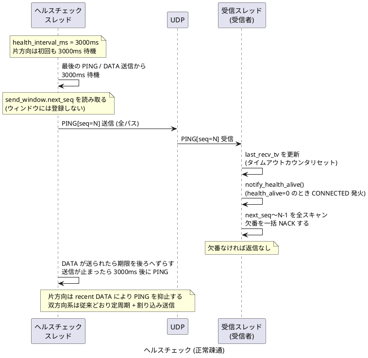
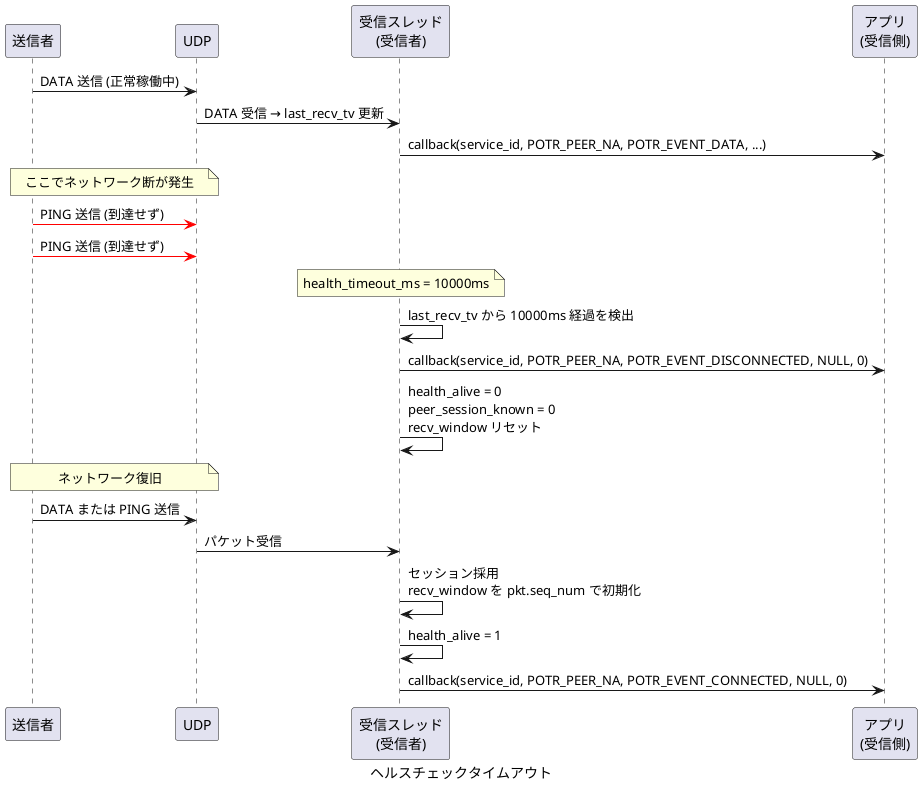

# UDP のヘルスチェックのシーケンス

[通信シーケンスの一覧](sequence.md) へ戻ります。

## ヘルスチェック (正常疎通)

ヘルスチェックが有効な場合の PING 送信です。片方向 type 1-6 は open 直後の即時 PING を行わず、最後の `PING` または有効 `DATA` 送信から `health_interval_ms` 経過したときだけ PING を送ります。双方向 UDP では従来どおり定周期 PING と、`path_ping_state[]` 変化時の割り込み PING を送出します。双方向 UDP はこの PING 往復で `CONNECTED` するため、実効 `health_interval_ms = 0` のままでは接続確立しません。

## ヘルスチェック タイムアウト

片方向 type 1-6 で、最後の有効な `PING` / `DATA` から一定時間パケットが届かなくなった場合の切断検知と復帰です。

