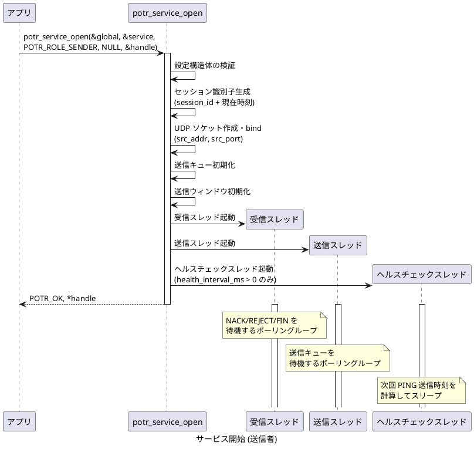
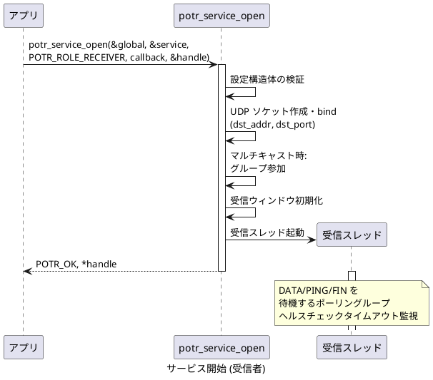
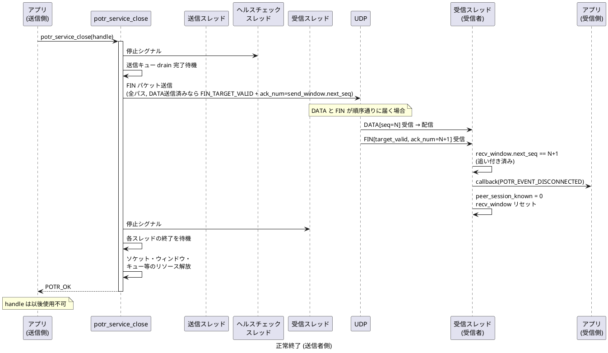
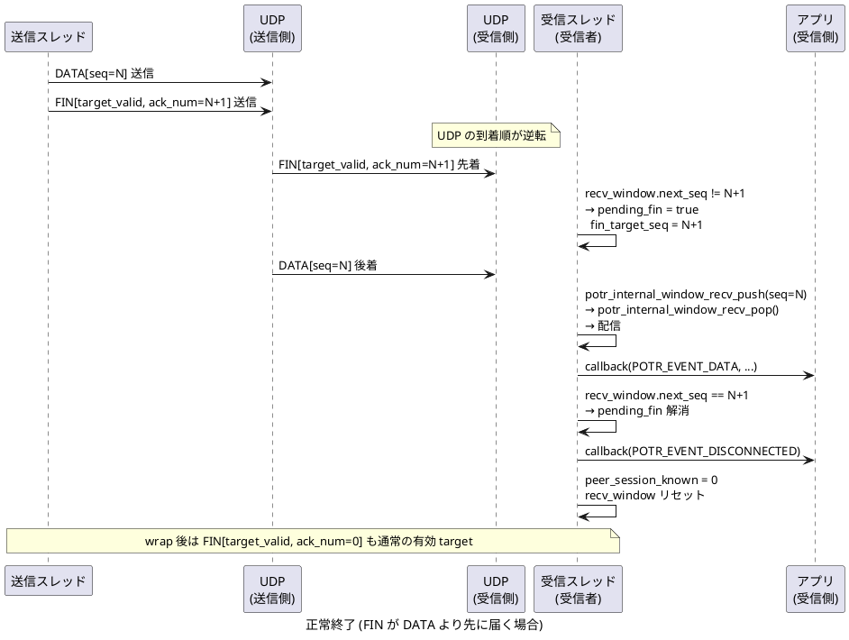
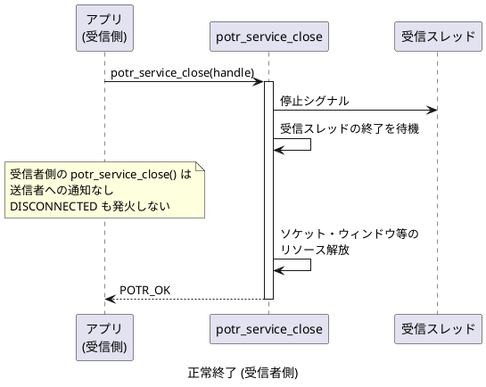
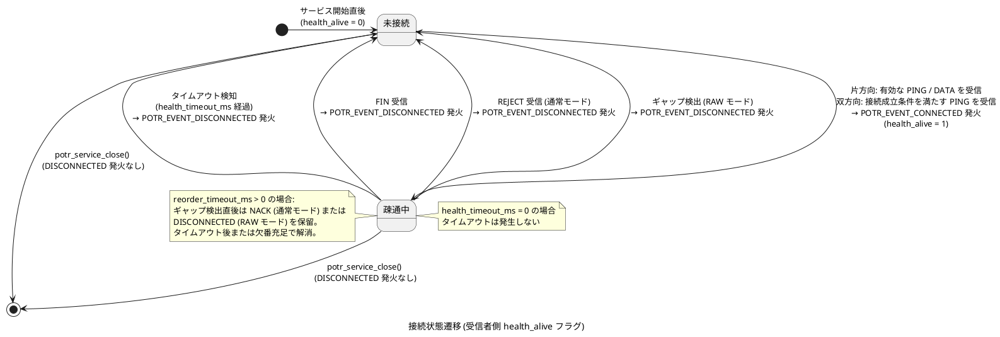

# サービスの開始と終了のシーケンス

[通信シーケンスの一覧](sequence.md) へ戻ります。

## サービス開始 (送信者)

`potr_service_open()` を SENDER として呼び出したときの内部処理です。

## サービス開始 (受信者)

`potr_service_open()` を RECEIVER として呼び出したときの内部処理です。

## サービス終了 (potr_service_close)

`potr_service_close()` による正常終了シーケンスです。

### 送信者側の終了 (DATA/FIN が順序通りに届く場合)

### 送信者側の終了 (FIN が DATA より先に届く場合)

UDP の到達順序は保証されないため、FIN が最後の DATA より先に受信側へ届く場合があります。  
受信側は `FIN.ack_num` を参照して DATA の到着を待機します。

### 受信者側の終了

## 補足: 接続状態の遷移

