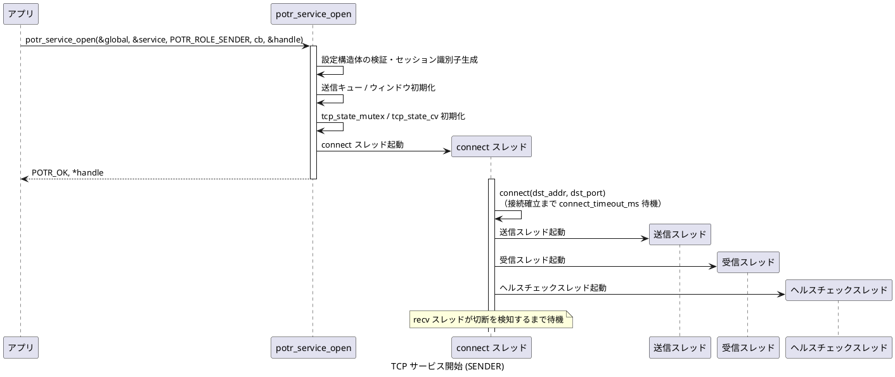
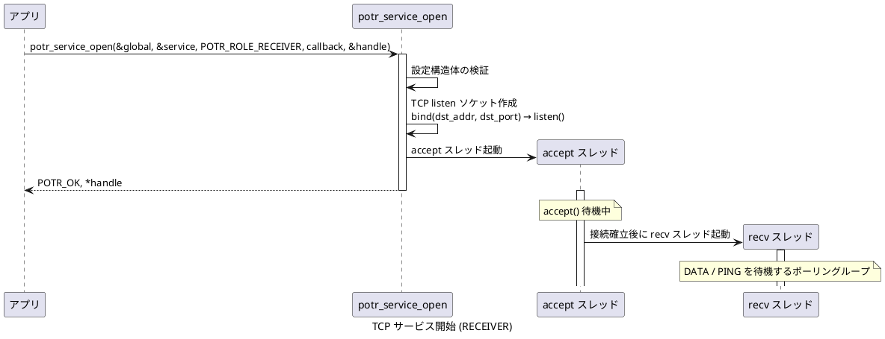
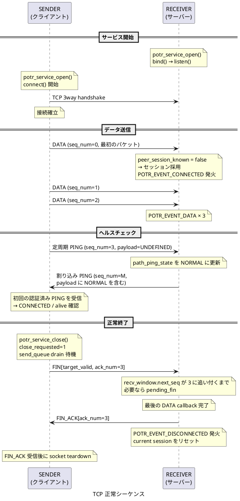
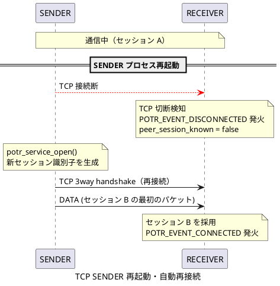
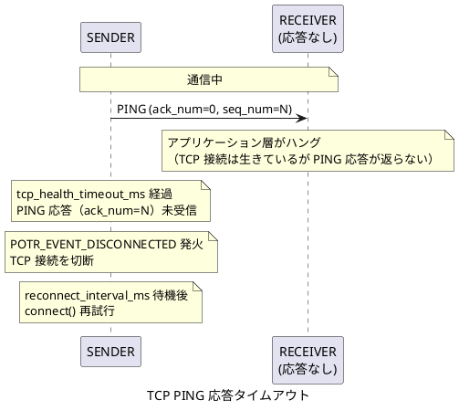
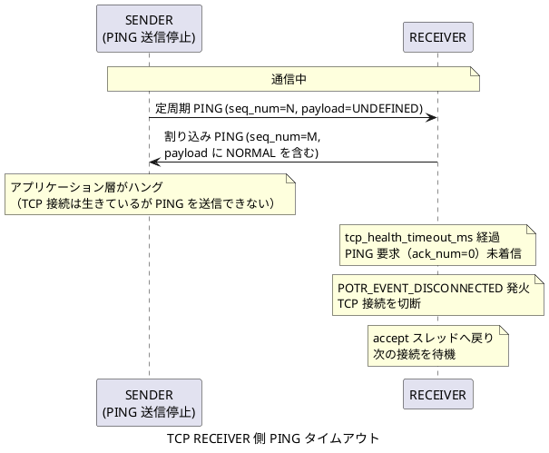
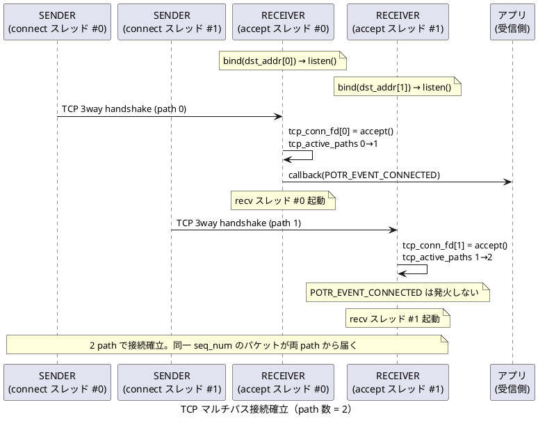
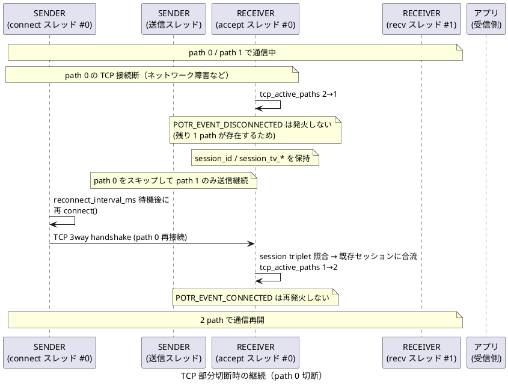
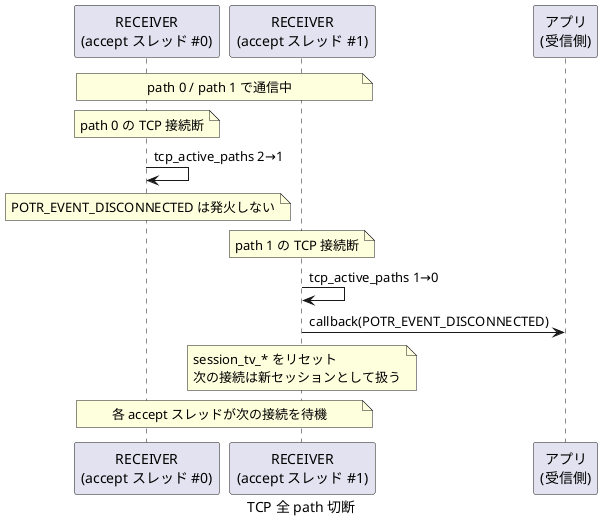

# TCP 通信のシーケンス

[通信シーケンスの一覧](sequence.md) へ戻ります。

## TCP サービス開始 (SENDER)

`potr_service_open()` を TCP SENDER として呼び出したときの内部処理です。  
`potr_service_open()` はすぐに返り、接続確立は connect スレッドが非同期に行います。

## TCP サービス開始 (RECEIVER)

`potr_service_open()` を TCP RECEIVER として呼び出したときの内部処理です。

## TCP 正常接続・通信・切断

TCP SENDER / RECEIVER 間の正常な接続確立・データ送信・切断シーケンスです。

## TCP SENDER 再起動・自動再接続

SENDER プロセスが再起動した場合に自動再接続が行われるシーケンスです。

## TCP PING 応答タイムアウト

RECEIVER のアプリケーション層がハングした場合に SENDER が切断を検知するシーケンスです。  
TCP 接続は OS レベルで生存していてもアプリ層の PING 応答が途絶えることで検知します。

## TCP RECEIVER 側 PING タイムアウト

SENDER のアプリケーション層がハングして PING 送信が停止した場合に RECEIVER が切断を検知するシーケンスです。  
TCP 接続は OS レベルで生存していても、PING 要求が届かなくなることで RECEIVER が検知します。

## TCP マルチパス

### TCP マルチパス接続確立

path 数 = 2 の例。RECEIVER が 2 つの listen ソケットを用意し、SENDER が各 path に接続します。  
最初の 1 本が接続した時点で `POTR_EVENT_CONNECTED` が発火します。

### 部分切断時の継続

1 本の path が切断しても残りの path で通信を継続します。  
`POTR_EVENT_DISCONNECTED` は発火しません。

### 全 path 切断

全 path が切断した時点で `POTR_EVENT_DISCONNECTED` が発火します。

